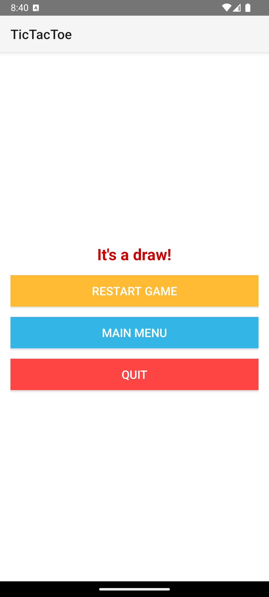

# Tic Tac Toe
(app/src/main/res/mipmap-hdpi/ic_launcher.png)
## Cuprins
1. [Descriere](#descriere)
2. [Capturi de ecran](#capturi-de-ecran)
3. [Structura proiectului](#structura-proiectului)
4. [Funcționalități principale](#funcționalități-principale)
5. [Exemple din cod](#exemple-din-cod)
6. [Interfața utilizatorului](#interfața-utilizatorului)
7. [Cum să rulezi aplicația](#cum-să-rulezi-aplicația)
8. [Tehnologii utilizate](#tehnologii-utilizate)
9. [Planuri viitoare](#planuri-viitoare)

---

## Descriere
Tic Tac Toe este o aplicație Android care permite utilizatorilor să joace clasicul joc de X și O fie local, fie împotriva unui oponent AI. Aplicația oferă o interfață simplă și intuitivă pentru a recrea acest joc popular.

---

## Capturi de ecran

### 1. Meniul principal


### 2. Tabla de joc la început


### 3. Joc finalizat - Câștigător


### 4. Joc finalizat - Egalitate


### 5. Ecranul "Game Over"


---

## Structura proiectului

```plaintext
app/
├── manifests/
│   └── AndroidManifest.xml
├── java/
│   └── dandobre.tictactoe/
│       ├── MainActivity.java
│       ├── GameActivity.java
│       ├── WinningLineView.java
│       ├── ExampleInstrumentedTest.java
│       └── ExampleUnitTest.java
├── res/
│   ├── drawable/
│   │   ├── cell_border.xml
│   │   ├── ic_launcher_background.xml
│   │   └── ic_launcher_foreground.xml
│   ├── layout/
│   │   ├── activity_main.xml
│   │   └── activity_game.xml
│   ├── mipmap/
│   │   ├── ic_launcher/
│   │   │   ├── ic_launcher.png (hdpi, mdpi, xhdpi, xxhdpi, xxxhdpi)
│   │   └── ic_launcher_round/
│   │       ├── ic_launcher_round.webp (hdpi, mdpi, xhdpi, xxhdpi, xxxhdpi)
│   │       └── ic_launcher_round.xml
│   ├── values/
│   │   ├── colors.xml
│   │   ├── strings.xml
│   │   ├── styles.xml
│   │   └── themes/
│   │       ├── themes.xml
│   │       └── themes.xml (night)
│   └── xml/
│       ├── backup_rules.xml
│       └── data_extraction_rules.xml
```

### Detalii despre directoare

1. **`manifests`**:
   - **AndroidManifest.xml**: Definește activitățile aplicației, permisiunile, și alte metadate importante.

2. **`java/dandobre.tictactoe`**:
   - **MainActivity.java**: Ecranul principal (meniu) al aplicației.
   - **GameActivity.java**: Logica principală a jocului.
   - **WinningLineView.java**: Clase pentru desenarea liniilor câștigătoare.
   - **ExampleInstrumentedTest.java** și **ExampleUnitTest.java**: Teste unitare și instrumentate pentru aplicație.

3. **`res/drawable`**:
   - Resurse grafice pentru aplicație, cum ar fi contururile butoanelor.

4. **`res/layout`**:
   - **activity_main.xml**: Layout-ul pentru meniul principal.
   - **activity_game.xml**: Layout-ul pentru tabla de joc.

5. **`res/mipmap`**:
   - Icoane ale aplicației pentru diferite densități de ecran.

6. **`res/values`**:
   - **colors.xml**: Definește culorile utilizate.
   - **strings.xml**: Conține textul afișat.
   - **styles.xml**: Conține stiluri reutilizabile pentru layout-uri.
   - **themes.xml**: Tema aplicației pentru modurile zi/noapte.

7. **`res/xml`**:
   - **backup_rules.xml**: Reguli de backup.
   - **data_extraction_rules.xml**: Reguli pentru extragerea datelor.

---

## Funcționalități principale

1. **Meniul principal**:
   - Permite utilizatorilor să aleagă unul dintre modurile de joc: joc local, joc împotriva AI-ului sau ieșirea din aplicație.

2. **Joc local**:
   - Două persoane pot juca pe același dispozitiv, alternând mutările („X” și „O”).

3. **Joc cu AI**:
   - Jucătorul concurează împotriva unui oponent AI care utilizează o strategie simplă pentru mutări.

4. **Finalizarea jocului**:
   - Determină automat dacă un jucător a câștigat, jocul este un egal sau există mutări disponibile.

5. **Resetare**:
   - Permite reluarea jocului de la zero.

6. **Navigare**:
   - Butoane pentru revenirea la meniul principal sau pentru închiderea aplicației.

---

## Exemple din cod

### 1. **Inițializarea butoanelor în MainActivity**:
```java
Button localPlayButton = findViewById(R.id.button_play_local);
localPlayButton.setOnClickListener(view -> {
    Intent intent = new Intent(MainActivity.this, GameActivity.class);
    intent.putExtra("mode", "local");
    startActivity(intent);
});

Button aiPlayButton = findViewById(R.id.button_play_ai);
aiPlayButton.setOnClickListener(view -> {
    Intent intent = new Intent(MainActivity.this, GameActivity.class);
    intent.putExtra("mode", "ai");
    startActivity(intent);
});

Button quitButton = findViewById(R.id.button_quit);
quitButton.setOnClickListener(view -> finish());
```

### 2. **Configurarea tablei de joc în GameActivity**:
```java
private void setupBoard() {
    GridLayout gridLayout = findViewById(R.id.grid_board);

    for (int i = 0; i < gridLayout.getChildCount(); i++) {
        final int row = i / 3;
        final int col = i % 3;
        final Button cell = (Button) gridLayout.getChildAt(i);

        buttonGrid[row][col] = cell;

        cell.setText("");
        board[row][col] = null;
        gameplayLayout.setVisibility(View.VISIBLE);
        gameOverLayout.setVisibility(View.GONE);

        cell.setOnClickListener(v -> {
            if (!cell.getText().toString().isEmpty() || isGameOver()) {
                return;
            }
            if (isPlayerOneTurn) {
                cell.setText("X");
                cell.setTextColor(getResources().getColor(R.color.xColor));
                board[row][col] = "X";

                if (!checkWin() && !checkDraw()) {
                    isPlayerOneTurn = !isPlayerOneTurn;
                    statusTextView.setText(mode.equals("ai") ? "AI's Turn (O)" : "Player 2's Turn (O)");
                    if (mode.equals("ai")) {
                        aiMakeMove();
                    }
                }
            } else if (mode.equals("local")) {
                cell.setText("O");
                cell.setTextColor(getResources().getColor(R.color.oColor));
                board[row][col] = "O";

                if (!checkWin() && !checkDraw()) {
                    isPlayerOneTurn = true;
                    statusTextView.setText("Player 1's turn (X)");
                }
            }
        });
    }
}
```

### 3. **Logica AI pentru efectuarea unei mutări**:
```java
private void aiMakeMove() {
    GridLayout gridLayout = findViewById(R.id.grid_board);
    gridLayout.postDelayed(() -> {
        if (isGameOver()) return;

        int[] bestMove = getBestMove();
        if (bestMove != null) {
            int row = bestMove[0];
            int col = bestMove[1];
            Button cell = (Button) gridLayout.getChildAt(row * 3 + col);
            cell.setText("O");
            cell.setTextColor(getResources().getColor(R.color.oColor));
            board[row][col] = "O";

            if (!checkWin()) {
                isPlayerOneTurn = !isPlayerOneTurn;
                statusTextView.setText("Your turn (X)");
            }
        }
    }, 500);
}
```

---

## Interfața utilizatorului

### Meniul principal (`activity_main.xml`)
- Include trei butoane:
  - **Play Locally**: Pornește un joc local.
  - **Play vs AI**: Pornește un joc cu AI.
  - **Quit**: Închide aplicația.

### Tabla de joc (`activity_game.xml`)
- **Gameplay Layout**:
  - Grilă 3x3 pentru tabla de joc.
  - Statusul curent al jocului afișat deasupra tablei.
- **Game Over Layout**:
  - Afișează mesajul de finalizare (câștig sau egalitate) și oferă opțiuni pentru restart, revenire la meniul principal sau ieșirea din aplicație.

---

## Cum să rulezi aplicația

1. **Clonează repository-ul**:
   ```bash
   git clone https://github.com/dd00000/TicTacToe.git
   ```

2. **Deschide proiectul în Android Studio**:
   - Asigură-te că toate dependențele sunt sincronizate corect.

3. **Rulează aplicația**:
   - Utilizează un emulator sau un dispozitiv Android conectat pentru a testa aplicația.

---

## Tehnologii utilizate

- **Limbaj de programare**: Java
- **Platformă**: Android
- **Layout-uri**: XML
- **Librării utilizate**:
  - Design nativ Android

---

## Planuri viitoare

1. **Adăugarea unui nivel de dificultate pentru AI**.
2. **Integrarea unui mod multiplayer online**.
3. **Personalizarea tablei de joc cu teme diferite.**
